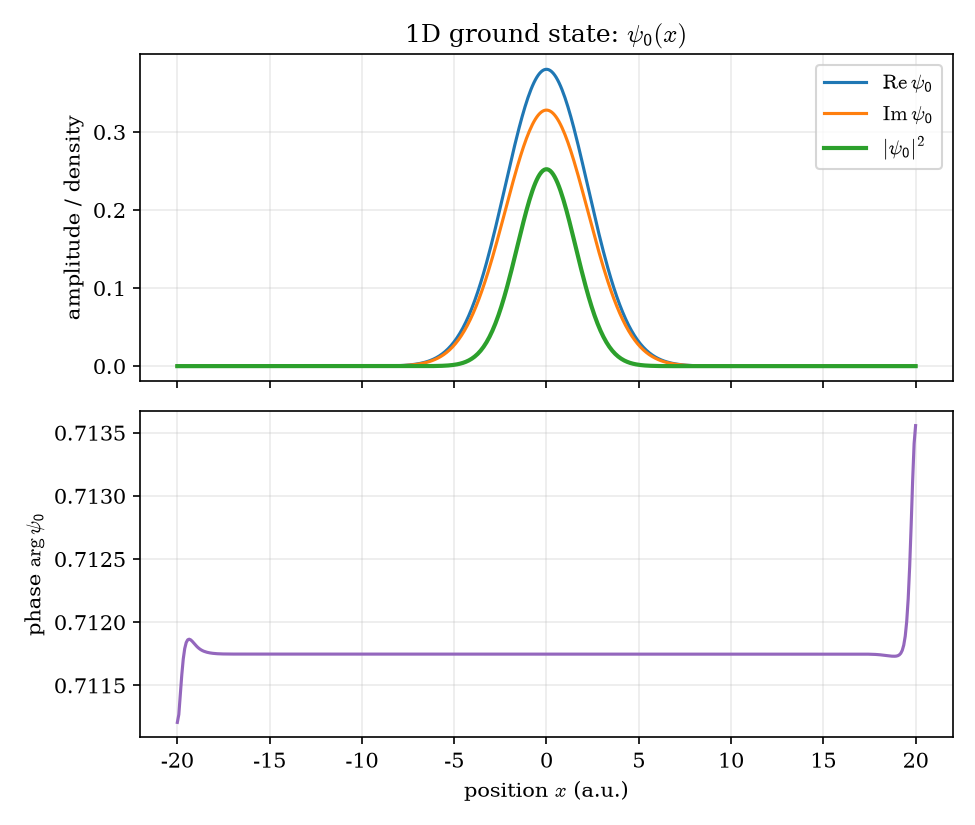
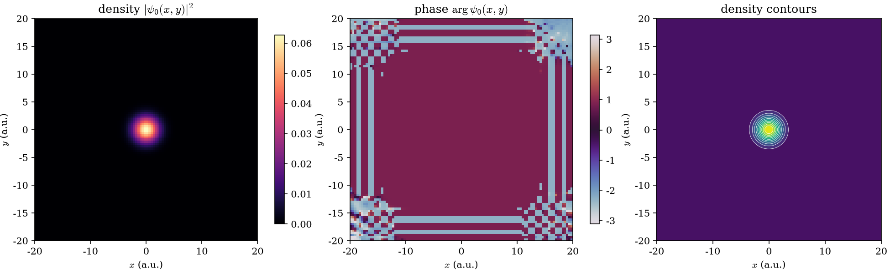
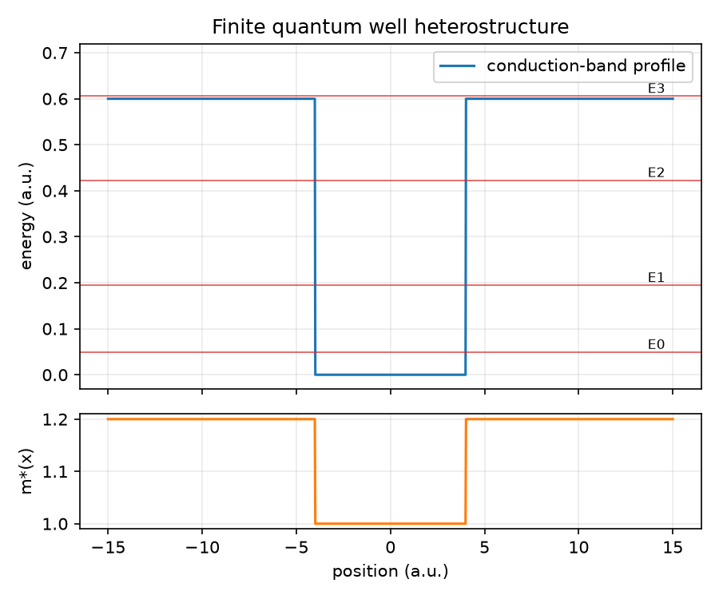
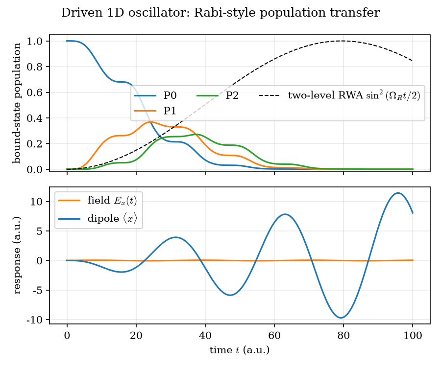
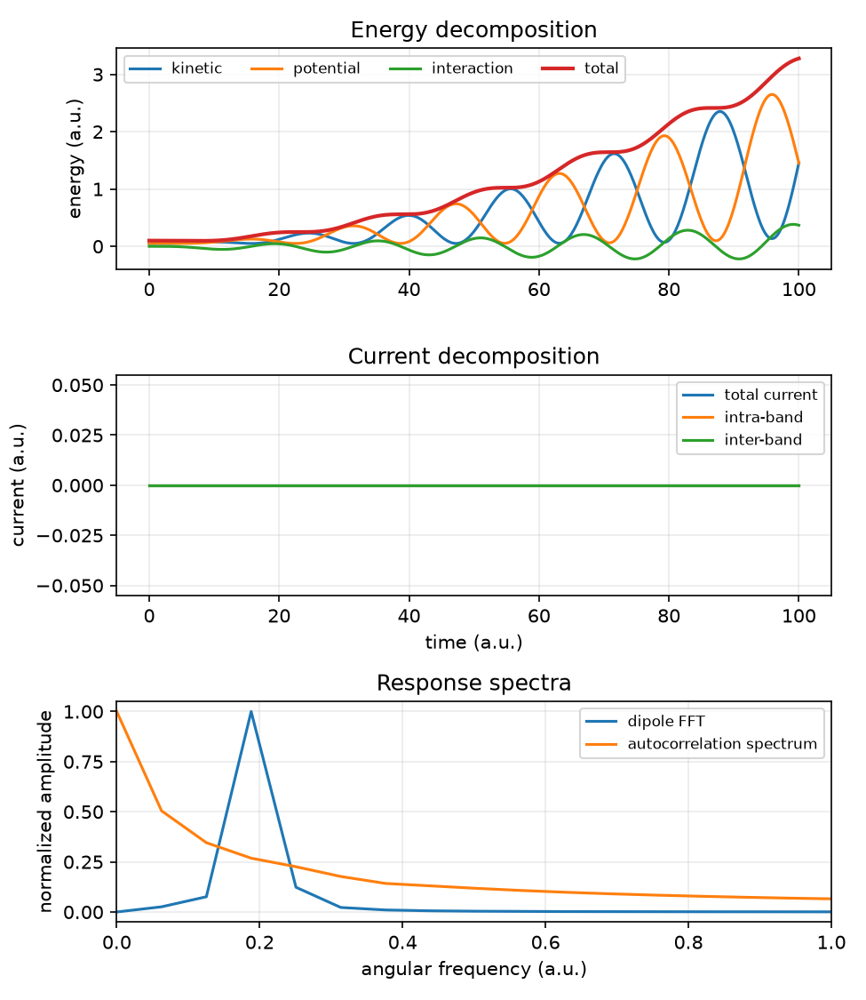
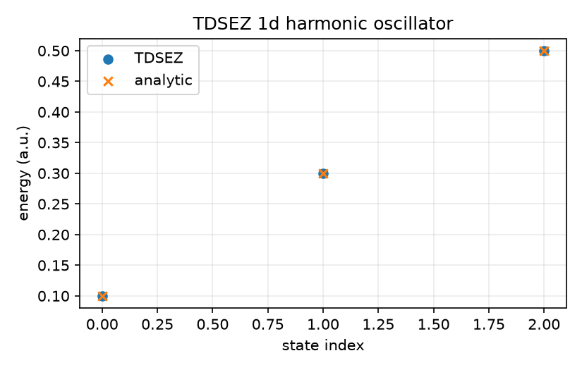
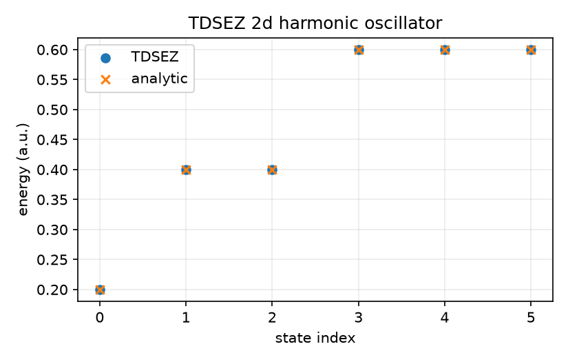
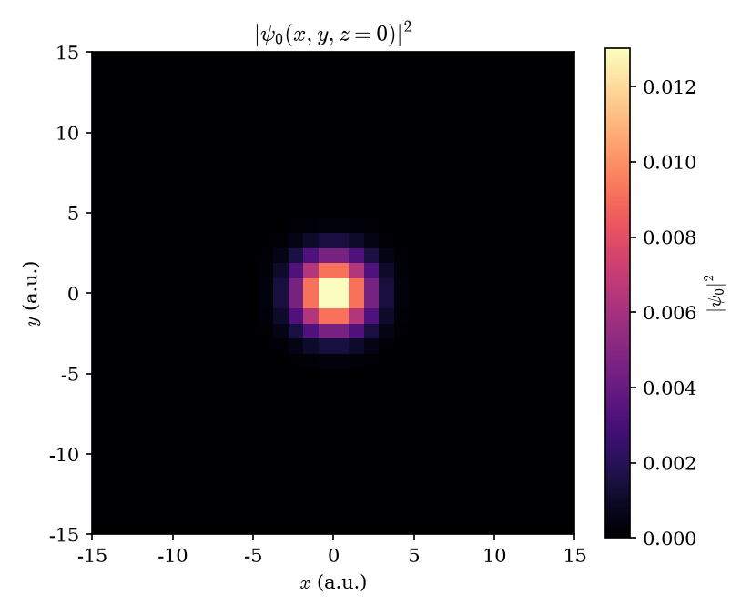

Quick oscillator, heterostructure, and dynamics examples
=========================================================

The repository includes small, deterministic TDSEZ examples for static
oscillators, a three-dimensional reconstruction smoke test, a finite quantum
well, and driven dynamics.  Static cases disable propagation and complete in a
few seconds, including MPI/PETSc startup.

Build TDSEZ in a separate directory, then run the examples from the zkit
checkout::

   python -m pip install -e ".[viz]"
   cmake -S /path/to/tdsez -B /tmp/tdsez-build -DCMAKE_BUILD_TYPE=Release -DBUILD_TESTING=OFF
   cmake --build /tmp/tdsez-build --target tdsez --parallel 4
   python examples/run_quick_examples.py --tdsez /tmp/tdsez-build/tdsez

The runner writes the copied decks, HDF5 outputs, CSV data, and PNG plots below
``examples/output``.  Select a case with ``--case 1d``, ``2d``, ``3d``,
``heterostructure``, or ``rabi``.  Use ``--case all`` to run the complete
smoke-test set.

For the oscillator checks, the analytic references are

.. math::

   E_n^{(1D)} = \hbar\omega\left(n+\tfrac12\right),
   \qquad
   E_{n_x,n_y}^{(2D)} = \hbar\omega\left(n_x+n_y+1\right).

The 1D case also writes a ground-state diagnostic containing the real and
imaginary components, probability density, and unwrapped phase.  The 2D case
writes density, phase, and filled contour views of the ground state.  These
plots are useful for checking parity, localization, nodal structure, and
phase conventions before analyzing larger calculations.

The runner also includes a finite quantum-well heterostructure:

.. code-block:: bash

   python examples/run_quick_examples.py --tdsez /tmp/tdsez-build/tdsez --case heterostructure

This example uses a 0.6 a.u. conduction-band offset outside ``-4 < x < 4``
and a 20% larger barrier effective mass.  It produces ``profile.csv`` and a
``potential_and_levels.png`` plot showing the band profile, effective mass,
and computed bound-state energies.

Driven dynamics and Rabi-style transfer
---------------------------------------

The ``rabi`` case starts in the harmonic-oscillator ground state and applies
``E_x(t) = 0.05 sin(0.2 t)``.  The carrier is resonant with the 0-to-1 level
spacing.  Run it with::

   python examples/run_quick_examples.py --tdsez /tmp/tdsez-build/tdsez --case rabi

The resulting ``rabi-populations-response.png`` contains bound-state
populations, the applied electric field, and the dipole response.  The CSV
file contains those observables for further Fourier, susceptibility, or
quantum-beating analysis.

The dashed curve is the analytic two-level rotating-wave estimate

.. math::

   P_1(t) \simeq \sin^2\!\left(\frac{E_0 |x_{01}| t}{4}\right),
   \qquad |x_{01}|=\sqrt{\frac{\hbar}{2m\omega}},

with ``E0 = 0.05`` and ``omega = 0.2`` in atomic units.  The TDSEZ curves
retain the full three-state dynamics, so their difference from this dashed
reference shows where the two-level approximation breaks down.

The runner also creates ``energy-current-spectra.png``.  It combines the
kinetic, potential, interaction, and total energies; the intra-band,
inter-band, and total currents; and normalized Fourier spectra of the dipole
and autocorrelation.  These are useful diagnostics for energy exchange,
selection rules, and quantum beating.

Reference spectra from this run:

Three-dimensional reconstruction
--------------------------------

The ``3d`` case uses eight cubic B-spline functions per axis and computes the
ground state of an isotropic oscillator.  Its analytical ground-state energy
is ``E_000 = 3 hbar omega / 2 = 0.3`` a.u.; the coarse smoke test returns
approximately ``0.3006`` a.u.  Run it with::

   python examples/run_quick_examples.py --tdsez /tmp/tdsez-build/tdsez --case 3d

The runner reconstructs the three-dimensional field with the bundled evaluator
and saves a central ``z=0`` slice of ``|psi_0|^2``.

